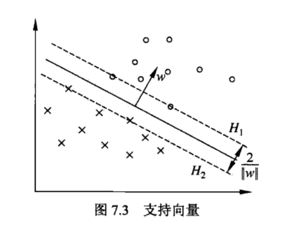

# SVM——支持向量机

## 总述
支持向量机是机器学习方法中较为出色的一种二分类方法，该方法不同于其他分类方法使用所有的数据进行模型参数的更新，SVM最终的模型仅仅由为数不多的支持向量决定，因此具有鲁棒性强的优点，同时由于数学推理方法的关系，SVM能很自然的引入核函数，因此可以进行非线性数据的分类。详细可以参考[blog](https://blog.csdn.net/jieming2002/article/details/79317496)

&nbsp;
---
## 先验知识
### 函数间隔
函数距离定义如下：
$$
\hat{r_{i}} = y_i(wx_i+b)
$$
对于直线模型$(w, b)$，样本点带入模型之后的值$(wx_i+b)$表示样本点对直线的距离，其中正负号代表着方向（在直线的上方还是下方），与样本点的类别做乘就能表征分类的正确性，乘积为正，则分类正确；乘积为负，则分类错误。

虽然函数距离能反应模型的正确与否，但是不能对正确值进行量化，比如对直线模型同时缩小或者放大，最终得到的值就跟着放大和缩小。这样的尺度不确定性对于优化问题是致命的，因此引入下面的几何距离。

### 几何间隔
几何距离的定义如下：
$$
r_{i} = \frac{y_i(wx_i+b)}{||w||}
$$

几何距离反应样本点到直线的真实距离(且包含)，没有尺度不一致的问题，因此我们用几何距离作为度量距离的标准来找到最佳的直线模型。

&nbsp;
---
### 线性可分SVM推导

对于一个好的分离平面$(w, b)$，所有的样本点都应该与该直线保持一定的几何距离，即
$$
对\forall x_i，有\frac{y_i(wx_i+b)}{||w||}\ge \gamma
$$

自然而然，如果我们在所有满足上式的条件下，不断的增加$\gamma$，使得$\gamma$最大，则此时的直线模型就必将是最优的直线模型$(w^*, b^*)$（此时该直线应该正好在正例和负例之间，且与正例负例都有一定的距离）。所以我们可以将上述思想变为下面有约束的最优化问题：
$$
\begin{aligned}
&max \quad \gamma \\
&s.t. \quad \frac{y_i(wx_i+b)}{||w||}\ge \gamma \quad i=1,2,...,N
\end{aligned}
$$

对上式进行变换如下：
$$
\begin{aligned}
&max \quad \frac{\hat{\gamma}}{||w||} \\
&s.t. \quad \frac{y_i(wx_i+b)}{||w||}\ge \frac{\hat{\gamma}}{||w||} \quad i=1,2,...,N
\end{aligned}
$$
可以看到，我们再次变换出了函数间隔$\hat{\gamma}$，上面说到，函数间隔是没有尺度的，那么既然如此，**干脆将其强行设置为1，为数学推到做出强有力的贡献**，因此上面的带约束的优化问题就变为：
$$
\begin{equation}
\begin{split}
&max \quad \frac{1}{||w||} \Rightarrow min \quad \frac{1}{2}||w||^2 \\
&s.t. \quad y_i(wx_i+b)\ge 1 \quad i=1,2,...,N 
\end{split}  
\end{equation}
$$

至此我们得到了最为核心的优化问题形式。求解该模型并不困难，高等数学中有方法叫做[**拉格朗日乘子法**](https://blog.csdn.net/qq_40036484/article/details/80457800)，想要详细了解的同学可以看看链接的博客，这里不介绍原理进行推导。

首先根据优化问题构建拉格朗日方程：
$$
\begin{align}
L(w, \alpha) &= \frac{1}{2}||w||^2+\sum_{i=1}^{N}\alpha_i(1-y_i(wx_i+b)) \\
s.t.\quad & \alpha_i \ge 0
\end{align}
$$

拉格朗日告诉我们，要想求得原来问题的最优解，需要求解拉格朗日方程的极小极大问题，即下述方程的解
$$
\mathop{min}_{w} \mathop{max}_{\alpha}L(w,\alpha)
$$

笔者在彻底了解这个算法之前，看到这个拉格朗日方程的时候第一个想法就是将$w=0，\alpha=0$，此时拉格朗日方程可以取到最小值：0，但是SVM理论的严谨性杜绝了这种情况。上面的错误由以下两个约束条件推翻：

- a. 因为原始问题满足$y_i(wx_i+b)\ge 1$，一旦设$w$为0，则该方程变为$y_ib\ge 1$，因为这是一个二分类问题，要想满足这个条件，则b不可能有解，所以$w$不可能为0；
- b. 对于$\alpha_i$，若$1-y_i(wx_i+b) < 0$，则为了$L(w, \alpha)$最小，$\alpha_i$必然要取0；但是若$1-y_i(wx_i+b) = 0$，则根据极小极大问题，此时$\alpha_i$可以取任意大于0的值，则必然不取0值；

上述问题通过拉格朗日乘子法已经应用对偶性质（下面介绍）之后，我们能通过一系列的引入参数$\alpha_i$表示直线模型$(w^*, b^*)$，其中大多数的$\alpha_i=0$，说明这些样本都是分类正确的样本（距离很远），并不会对分离平面有什么影响，而对于$\alpha_i \ne 0$的情况而言，这些样本才是决定分离平面的最重要的样本，算法中称之为**支持向量**。一个例子如下图：

可以看到，对于线性可分的SVM算法而言，分离平面与所有的样本点至少保持着$\frac{1}{||w||}$的距离，没有任何样本点落在这个距离带中，而决定这个距离的，仅仅由很少的几个重要的样本决定，在理论上保证了算法对于噪声的鲁棒性。

&nbsp;
---
### 线性不可分SVM推导
对于上述线性可分SVM，线性不可分模型就是样本$x_i$与分离平面的几何间隔小于0，
