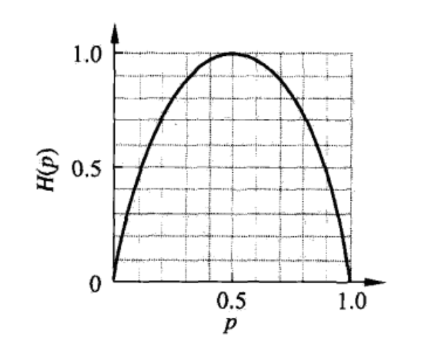

# 决策树

## 特点
决策树是一种基本的分类与回归方法，是一种树形结构，由内部结点和叶节点组成，其中：
- 内部结点表示一个特征和属性；
- 叶节点表示最终的分类了；

一个实例如下，其中椭圆为内部结点，方框为叶节点：

&nbsp;
## 决策树与概率分布
决策树表示在给定特征条件下类的条件概率分布，这一条件概率分布定义在对特征空间的划分上。从模型的类型上讲，决策树属于判别模型，即最终求解的是$P(Y|X)$。

&nbsp;
## 决策树的学习
决策树的整个学习过程可以分为：
- 特征选择：局部的学习特征与类别的关系
- 决策树生成：根据选择的特征对数据集进行分类，递归的构建，直到划分之后的特征基本只有一类或者没有合适的特征进行分类
- 决策树剪枝：因为决策树对于特征的过细分类，导致决策树很容易过拟合，解决该问题的方法就是剪枝，将模型变得稍微简单一些，该部分的本质是通过操作使得损失函数（通常是正则化的极大似然函数）最小化。

&nbsp;
## 先验知识
### 熵
熵表示信息的混乱程度（不确定性），通常用H(D)表示，其中X={(x1,y1), (x2,y2)...(xn,yn)}表示数据集，如果不加特殊的说明，H(D)表示对标签y的概率分布P(y)计算熵。
熵的公式如下：
$$
H(X)=-\sum_{i=1}^{n} p_{i} \log p_{i}
$$
其中如果log的底为2，则单位为比特，若log的底为e，则单位为纳特。
其中$-\log p_{i}$表示信息量（这里可以看做频率的倒数的对数值，P越大值越小），所以熵又可以看做是信息量的期望值。

举个例子来说：假设天气预报告诉你，明天90%的可能性会下雨，那么**该事件的确定性其实很大**，基本上你明天一定会带上雨伞，同理如果天气预报说下雨的可能性只有10%，那么你明天基本上就不会带伞；但是如果天气预报告诉你，明天50%的可能性会下雨，那么此时我们是最纠结的时候，因为**这时候事件的确定性是很小的**，我们最不确定明天是否会下雨。

以上就是一个二值的例子，如果用熵的公式表示这个时间的不确定性的话，可以得到下图：

可见当p=0.5的时候，事件的混乱度（不确定性）是最大的。

### 条件熵
将上述公式中换做：
$$
H(Y | X)=\sum_{i=1}^{n} p_{i} H\left(Y | X=x_{i}\right)
$$
就可以表示在已知其中一个条件$X=x_i$时，事件的不确定性。由公式可以看出，条件熵是条件概率的熵的期望。

例如明天的天气情况X与后天是否有雨Y，我们根据历来的一些数据知道了$P(Y|X={所有今天的天气状况})$ 的概率分布，那么我们就可以得到条件概率的熵，之后对明天的天气情况的概率分布$P(X)$求期望就得到了条件熵。

### 基尼系数
基尼系数与熵类似，也是衡量一个事件确定程度的数值，具体的公式如下：
$$
\operatorname{Gini}(p)=\sum_{k=1}^{K} p_{k}\left(1-p_{k}\right)=1-\sum_{k=1}^{K} p_{k}^{2}
$$

与熵类似，基尼系数对于条件概率表示的事件也能评价其确定性，公式如下：
$$
\operatorname{Gini}(D, A)=\frac{\left|D_{1}\right|}{|D|} \operatorname{Gini}\left(D_{1}\right)+\frac{\left|D_{2}\right|}{|D|} \operatorname{Gini}\left(D_{2}\right)
$$

### 总结
熵和基尼系数其实都是对于数据集确定性的一种度量方式，这里不进行过多介绍。

&nbsp;
## 特征选择
决策树的特征分类与人类的行为是一致的，都是选择一个特征，以该特征为基准进行数据集的划分。简单的来讲，在选择特征的时候，一定是向着划分之后的子集$\{S_i | S_i \in S \quad i=1,2,...,n\}$的确定度较高（即子集中的类别尽量都是一样的）的方向走，在程序实现时，往往会定义一个指标，让程序按照最大化或者最小化该指标的方向进行，这里我们把指标选择为信息增益。

### 信息增益（ID3采用）
信息增益的公式如下：
$$
G(D|A)=H(D)-H(D|A)
$$

可以较为明显的看出来，信息增益是说：对于数据集D，其整体不确定性随着知道特征A之后会下降多少。其中$H(D)$表示以label的熵，$H(D|A)$表示以特征A划分数据集后，所有子集不确定度的期望值。

### 信息增益比（C4.5采用）
信息增益比的公式如下：其中$H_A(D)$是A特征在数据集D中的不确定度。
$$
G(D|A)=\frac{H(D)-H(D|A)}{H_A(D)}
$$

对比于信息增益，信息增益比是信息增益对于自身不确定性的比值。

信息增益比主要解决的是信息增益会偏向取值较多的特征的问题，因为取值较多的特征，往往（不是一定）会把数据集划分的比较细，造成信息增益较大的局面，相比于这样的特征而言，我们往往更希望能够选择取值不多，但是也能使得数据集确定度增加的特征。

还是由今天的天气情况预测明天是否下雨：假如特征向量中有温度这个特征，其取值较多，对于数据集的划分很大，很容易就使得信息增益较大，从而被认为是最好的划分特征；但是我们清楚，今天有雨其实对于明天下雨是更有参考意义的，通过除以选择特征的不确定度（温度变量的熵一般情况下应该更大，而今天有雨与否的会小），使得度量值能够更公平的反应特征对于数据集确定度贡献的特性。

&nbsp;
## 生成决策树
有了上面的描述，生成决策树的思路其实就比较清晰了，一般我们使用递归的方法进行决策树的构建，描述如下：

输入变量：数据集D，特征名称A，阈值$\epsilon$. 

算法过程：
- a. 如果D中的所有类别都是一类，则生成叶节点，类为其中唯一的类；
- b. 如果A为空（没有更多的特征可以分割），则生成叶节点，类为其中最多的类别；
- c. 否则，对A中的每一个特征计算度量值（信息增益ID3或者信息增益比C4.5），选择其中使得度量值最大的特征$A_g$;
- d. 判断$A_g$是否小于阈值$\epsilon$，如果是，则返回叶节点，类为其中最多的类；
- e. 使用$A_g$的所有取值对数据集进行划分，得到子集$D_i$，该节点的类为所有数据中数量最多的类;
- f. 对于第i个子集$D_i$，特征名称为$A-A_g$，传入a中，递归的生成决策树。

&nbsp;
## 决策树的剪枝

决策树的剪枝是防止决策树过拟合的方法，由于决策树在生成的时候仅仅考虑了分类的准确度，模型在这个过程中会变得比较大，造成过拟合，防止过拟合的方法就是通过剪枝操作使得模型的规模减低，同时保证整体的熵不会降低很多。

### 代价函数

剪枝操作通过极小化代价函数的方式进行，其中代价函数可以如下所示（应有很多种方法定义，这里使用《统计学习方法》中的定义）：
$$
C_{\alpha}(T)=\sum_{t=1}^{|T|}N_tH_t(T)+\alpha|T|
$$
其中$\alpha$为平衡系数，$|T|$表示数量，该数量是以某一节点为根的树中包含的叶节点的数量，$N_t$为树中第t个叶节点中包含的样本数量，$H_t(T)$是第t个叶节点的熵（或者其他的度量值）。

对于$\alpha$，有如下几种情形：
- a. $\alpha=0$，此时不对树做修剪是最好的，因为一旦修剪，父节点变为叶节点，其中样本数量$N_t$变大，同时叶节点的熵也变大，整体变大；
- b. $\alpha=\inf$, 此时算法更关注模型的规模，因此把整个树修剪掉是最好的，因为此时树的深度就为1了。

