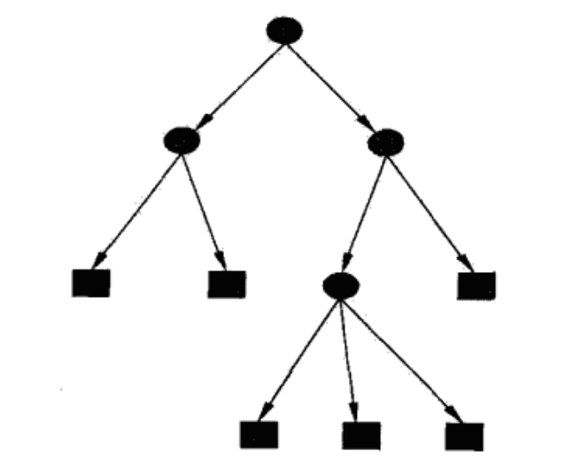

# 决策树

## 特点
决策树是一种基本的分类与回归方法，是一种树形结构，由内部结点和叶节点组成，其中：
- 内部结点表示一个特征和属性；
- 叶节点表示最终的分类了；

一个实例如下，其中椭圆为内部结点，方框为叶节点：

&nbsp;
## 决策树与概率分布
决策树表示在给定特征条件下类的条件概率分布，这一条件概率分布定义在对特征空间的划分上。从模型的类型上讲，决策树属于判别模型，即最终求解的是$P(Y|X)$。

&nbsp;
## 决策树的学习
决策树的整个学习过程可以分为：
- 特征选择：局部的学习特征与类别的关系
- 决策树生成：根据选择的特征对数据集进行分类，递归的构建，直到划分之后的特征基本只有一类或者没有合适的特征进行分类
- 决策树剪枝：因为决策树对于特征的过细分类，导致决策树很容易过拟合，解决该问题的方法就是剪枝，将模型变得稍微简单一些，该部分的本质是通过操作使得损失函数（通常是正则化的极大似然函数）最小化。

&nbsp;
## 先验知识
### 熵
熵表示信息的混乱程度，通常用H(D)表示，其中X={(x1,y1), (x2,y2)...(xn,yn)}表示数据集，如果不加特殊的说明，H(D)表示对标签y的概率分布P(y)计算熵。
熵的公式如下：
